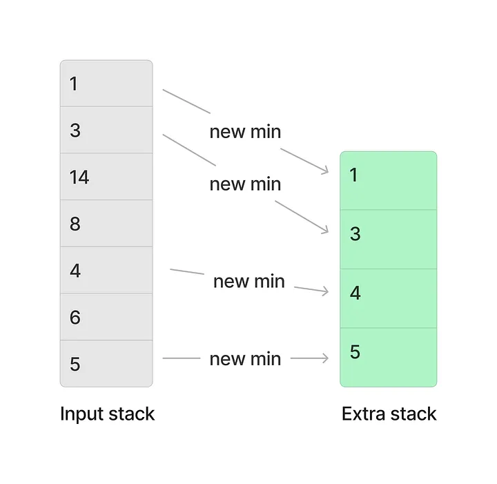
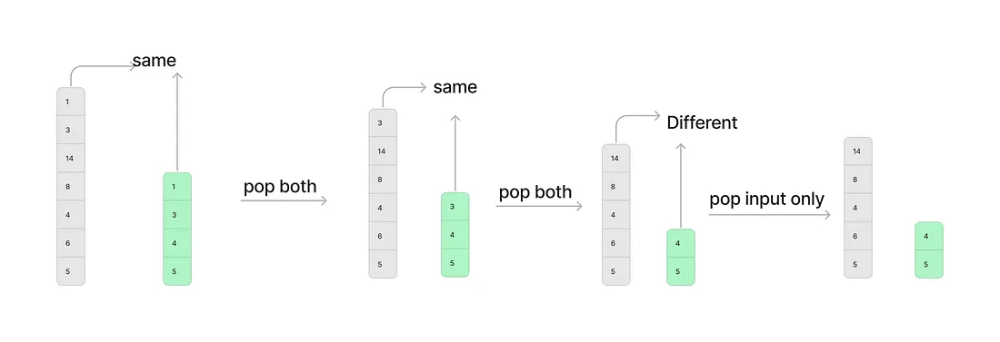

## 155. Min Stack 🗃️

**Difficulty**: `Medium` - **Tags**: `Stack`, `Design`

[LeetCode Problem Link](https://leetcode.com/problems/min-stack/)

---

### Problem Statement 📜

Design a stack that supports the following operations in constant time `O(1)`:

1. `void push(int val)`: Push the element `val` onto the stack.
2. `void pop()`: Remove the element on the top of the stack.
3. `int top()`: Retrieve the top element of the stack.
4. `int getMin()`: Retrieve the minimum element in the stack.

You must implement all these methods in constant time.

---

### Examples 🌟

🔹 **Example 1:**

**Input:**

```plaintext
["MinStack","push","push","push","getMin","pop","top","getMin"]
[[],[-2],[0],[-3],[],[],[],[]]
```

**Output:**

```plaintext
[null,null,null,null,-3,null,0,-2]
```

**Explanation:**

```plaintext
MinStack minStack = new MinStack();
minStack.push(-2);    // Stack: [-2]
minStack.push(0);     // Stack: [-2, 0]
minStack.push(-3);    // Stack: [-2, 0, -3]
minStack.getMin();    // return -3
minStack.pop();       // Stack: [-2, 0]
minStack.top();       // return 0
minStack.getMin();    // return -2
```

---

### Constraints ⚙️

- `-2^31 <= val <= 2^31 - 1`
- Methods `pop`, `top`, and `getMin` will always be called on non-empty stacks.
- At most `3 * 10^4` calls will be made to `push`, `pop`, `top`, and `getMin`.

---

### Solution 💡

The Mechanism
We use two stacks:
- stack: Stores every value pushed.
- minStack: Stores the minimum value encountered at that specific level of the stack

The space-optimized version of the Two-Stack Approach improves memory usage by only pushing to the minStack when the minimum actually changes or is duplicated.
1. Core Logic
   Instead of pushing a value to both stacks every time, you use conditional logic:
   - Push: Add the value to the minStack only if it is less than or equal to the current top of the minStack.
   - Pop: Remove the top of the minStack only if the value being popped from the mainStack is equal to the current minimum.
---

Why this is Optimized
In a standard approach, if you push 1,000 elements that are all larger than the current minimum, your minStack still grows to 1,000 elements. In the optimized version, the minStack size stays at 1, significantly reducing auxiliary space in many real-world scenarios





https://medium.com/@mishraananya0001/min-stack-a4fec0f2a475 

```java
class MinStack {
    private Stack<Integer> stack = new Stack<>();
    private Stack<Integer> minStack = new Stack<>();

    public void push(int val) {
        stack.push(val);
        // Only push to minStack if it's empty or val is new minimum
        if (minStack.isEmpty() || val <= minStack.peek()) {
            minStack.push(val);
        }
    }

    public void pop() {
        // Only pop from minStack if the value being removed is the current minimum
        // Note: Use .equals() for objects like Integer in Java to avoid reference comparison issues
        if (stack.pop().equals(minStack.peek())) {
            minStack.pop();
        }
    }

    public int top() {
        return stack.peek();
    }

    public int getMin() {
        return minStack.peek();
    }
}
```

#### Java Solution

Two Parallel Stacks (Recommended for Interviews)
- Structure: Maintain two separate stacks: a mainStack for all values and a minStack to track the minimums.
- Push: Push the value onto mainStack. For minStack, push the smaller of the new value or the current top of minStack.
- Pop: Pop from both stacks simultaneously to keep them synchronized.

```java
class MinStack {
    private Stack<Integer> stack;
    private Stack<Integer> minStack;

    public MinStack() {
        stack = new Stack<>();
        minStack = new Stack<>();
    }

    public void push(int val) {
        stack.push(val);
        // Push the current minimum to the minStack
        if (minStack.isEmpty() || val <= minStack.peek()) {
            minStack.push(val);
        } else {
            minStack.push(minStack.peek());
        }
    }

    public void pop() {
        stack.pop();
        minStack.pop();
    }

    public int top() {
        return stack.peek();
    }

    public int getMin() {
        return minStack.peek();
    }
}
```

---

### Explanation of the Solution

1. **Two Stacks**:

   - The main stack holds all the elements.
   - The min stack maintains the current minimum at every point.

2. **Push Operation**:

   - Push the element onto the main stack.
   - Update the min stack with the smaller of the new element and the current minimum.

3. **Pop Operation**:

   - Remove the top element from both stacks.

4. **Top Operation**:

   - Return the top element of the main stack.

5. **GetMin Operation**:
   - Retrieve the top element of the min stack, which represents the minimum.

---

### Time Complexity ⏳

- **Push**: `O(1)`
- **Pop**: `O(1)`
- **Top**: `O(1)`
- **GetMin**: `O(1)`

### Space Complexity 💾

- **O(n)**: We use two stacks, each storing up to `n` elements.

You can find the full solution [here](Solution.java).
