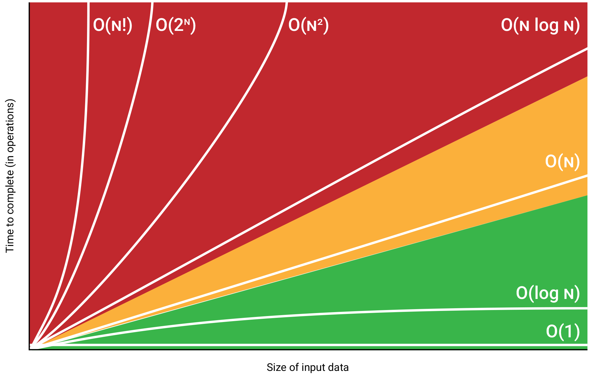

🔑  Big O Notation Rule Book

Definition: Big O describes the upper bound of an algorithm’s time or space complexity.

Notation: Written as O(f(n)), where f(n) is the growth rate of operations with input size n.

Focus: Usually worst‑case scenario.

Simplification Rules:

Drop constants: O(2n) → O(n)

Keep the dominant term: O(n^2 + n) → O(n^2)

Ignore lower‑order terms: O(n^3 + n^2) → O(n^3)

Nested loops multiply: Outer loop O(n) × inner loop O(n) → O(n^2)

Recursive calls depend on branching factor:

Binary Search recursion depth O(log n)

Divide‑and‑conquer often O(n log n)

# 📊 Common Growth Rates in Big O Notation

| Complexity | Example Algorithm              | Notes                                |
|------------|--------------------------------|--------------------------------------|
| **O(1)**   | Accessing array element        | Constant time                        |
| **O(log n)** | Binary search                | Shrinks problem size each step       |
| **O(n)**   | Linear search                  | Scales directly with input           |
| **O(n log n)** | Merge sort, Quick sort avg | Efficient sorting                    |
| **O(n^2)** | Bubble sort, nested loops      | Quadratic growth                     |
| **O(2^n)** | Recursive subset generation    | Exponential growth                   |
| **O(n!)**  | Traveling salesman brute force | Factorial growth, extremely expensive|



📦 Stack (LIFO)
```java
Deque<Integer> stack = new ArrayDeque<>();
//Stack<Integer> stack = new Stack<>();
stack.push(10);         // Add to top
int top = stack.pop();  // Remove from top
int peek = stack.peek(); // View top
```

Stack is legacy (extends Vector, which is synchronized and slower).

ArrayDeque is faster and non-synchronized.

ArrayDeque has better cache locality and performance.

No overhead of node objects (as in LinkedList).

📬 Queue (FIFO)
```java
Deque<Integer> queue = new ArrayDeque<>();
//Queue<Integer> queue = new LinkedList<>();
queue.offer(10);        // Add to rear
int front = queue.poll(); // Remove from front
int peekFront = queue.peek(); // View front
```

🔗 LinkedList - flexible insert/remove
```java
LinkedList<String> list = new LinkedList<>();
list.add("A");          // Append
list.addFirst("B");     // Add to front
list.removeLast();      // Remove from end
```
Custom Single Linked List
```java
public class Node {
    int data;
    Node next;

// Constructor
    public Node(int data) {
        this.data = data;
        this.next = null;
    }
}
```

Custom Double Linked List
```java
public class Node {
    int data;
    Node next;
    Node prev;


// Constructor
    public Node(int data) {
        this.data = data;
        this.next = null;
        this.prev = null;
    }
}
```
🌳 Binary Tree Node - hierarchial, acyclic
```java
class TreeNode { 
    
int val;
TreeNode left, right;
TreeNode(int val) {
    this.val = val; 
    }
}

TreeNode root = new TreeNode(1);
root.left = new TreeNode(2);
root.right = new TreeNode(3);
```

🌐 Graph (Adjacency List) - Flexible connections, can be cyclic
```java
Map<Integer, List<Integer>> graph = new HashMap<>();
graph.put(1, Arrays.asList(2, 3));
graph.put(2, Arrays.asList(4));
graph.put(3, Arrays.asList(4));

//observe get neighbors
graph.get(1); --> [2,3] are neignbors of 1
```
Custom Graph Node
```java
import java.util.List;
import java.util.ArrayList;
public class GraphNode {
    int data;
    List<GraphNode> neighbors;
    // Constructor
    public GraphNode(int data) {
        this.data = data;
        this.neighbors = new ArrayList<>();
    }
    // Add a neighbor
    public void addNeighbor(GraphNode neighbor) {
        this.neighbors.add(neighbor);
    }
}
```

Binary Tree & Graph Problems solutions approach:

Recursive solution is concise and intuitive. Can result in Stack overflow on very deep trees

Iterative solution avoids recursion stack overflow and is useful for very deep trees. Easy to understand and debug, easy to maintain.
Iterative can use more memory in wide trees.

Also, if possible prefer to use BreadFirstSearch(LevelOrderTraversal) with queue, for clarity and ease of solution.

For Dynamic programming solutions, some times there will be 2 solutions
1. with DP array - this array would need additional memory
2. Memory Optimized solution - without using DP array, use tracking variables of prior steps

🔺 Heap (Min-Heap)
```java
PriorityQueue<Integer> minHeap = new PriorityQueue<>();
//PriorityQueue is a minHeap by default
//PriorityQueue<Integer> maxHeap = new PriorityQueue<>((a, b) -> b - a);
minHeap.offer(5);       // Insert
int smallest = minHeap.poll(); // Remove min
int peekMin = minHeap.peek();  // View min
```


