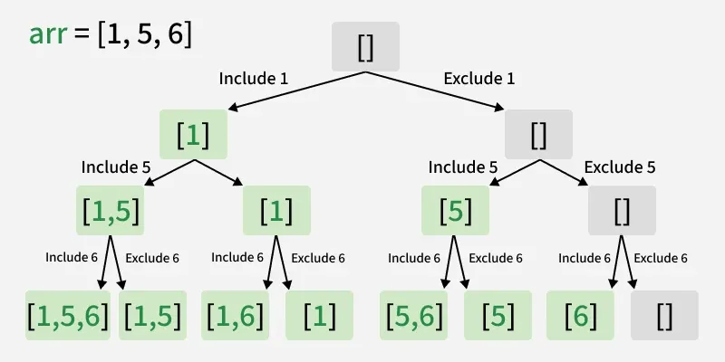
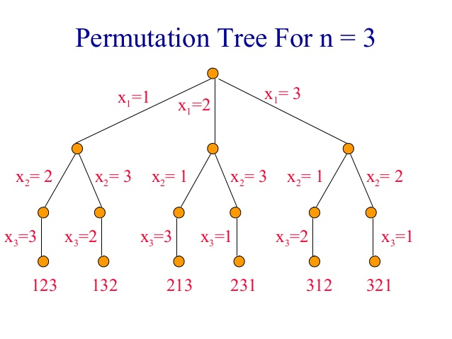

In Java, a backtracking template typically uses a helper method that maintains the state through recursion. This structure is commonly used to find all possible solutions for problems like permutations or subsets.

Universal Java Backtracking Template


```java
public List<List<Integer>> solveProblem(int[] nums) {
    List<List<Integer>> results = new ArrayList<>();
    // Optional: Arrays.sort(nums); // Helps with duplicates or ordered results
    backtrack(results, new ArrayList<>(), nums, 0);
    return results;
}

private void backtrack(List<List<Integer>> results, List<Integer> currentPath, int[] nums, int start) {
    // 1. BASE CASE: If a valid solution is found, add a COPY to results
    if (isSolution(currentPath)) {
        results.add(new ArrayList<>(currentPath)); 
        return;
    }

    // 2. ITERATE: Loop through possible choices
    for (int i = start; i < nums.length; i++) {
        // 3. PRUNING: Skip invalid options (optional)
        if (isInvalid(nums[i], currentPath)) continue;

        // 4. CHOOSE: Make the decision
        currentPath.add(nums[i]);

        // 5. EXPLORE: Recurse to find the next part of the solution
        // Use 'i + 1' for combinations, '0' or 'i' for others depending on rules
        backtrack(results, currentPath, nums, i + 1);

        // 6. UNCHOOSE: Backtrack by removing the last element
        currentPath.remove(currentPath.size() - 1);
    }
}

```

Key Components Explained

-   **Deep Copying Results:**  You must use  `new ArrayList<>(currentPath)`  because  `currentPath`  is a reference that changes.
-   **The for-loop:**  Often uses a  `start`  index to avoid using the same element twice (common in subset/combination problems).
-   **The Unchoose Step:**  This is critical. It resets the state so the previous recursive level can try a different branch of the decision tree.

Common Variations

-   **Permutations:**  Usually omit the  `start`  index and use a  `boolean[] visited`  array to track which elements are already in the  `currentPath`.
-   **Subsets:**  Every step in the recursion is a valid solution, so  `results.add(new ArrayList<>(currentPath))`  is placed at the very start of the  `backtrack`  method, before any conditions.





[Subsets (LeetCode 78)](https://leetcode.com/problems/subsets/)

-   **Goal:** Find all possible subsets (the power set).
-   **Key Variation:** Every state reached is a valid solution, so we add the current path to results at the very beginning of each call.


```java
public List<List<Integer>> subsets(int[] nums) {
    List<List<Integer>> results = new ArrayList<>();
    backtrackSubsets(results, new ArrayList<>(), nums, 0);
    return results;
}

private void backtrackSubsets(List<List<Integer>> results, List<Integer> current, int[] nums, int start) {
    // Every partial candidate is a valid subset
    results.add(new ArrayList<>(current));

    for (int i = start; i < nums.length; i++) {
        current.add(nums[i]);                     // CHOOSE
        backtrackSubsets(results, current, nums, i + 1); // EXPLORE
        current.remove(current.size() - 1);       // UNCHOOSE
    }
}

```

2. [Permutations (LeetCode 46)](https://leetcode.com/problems/permutations/)

-   **Goal:** Find all possible arrangements of unique integers.
-   **Key Variation:** We do not use a `start` index because order matters (we want to look at all elements every time). Instead, we use a `used` boolean array or a contains check.


```java
public List<List<Integer>> permute(int[] nums) {
    List<List<Integer>> results = new ArrayList<>();
    backtrackPermute(results, new ArrayList<>(), nums, new boolean[nums.length]);
    return results;
}

private void backtrackPermute(List<List<Integer>> results, List<Integer> current, int[] nums, boolean[] used) {
    // BASE CASE: Permutation is complete when it reaches the input length
    if (current.size() == nums.length) {
        results.add(new ArrayList<>(current));
        return;
    }

    for (int i = 0; i < nums.length; i++) {
        if (used[i]) continue; // PRUNING: Skip already used elements

        used[i] = true;
        current.add(nums[i]);              // CHOOSE
        backtrackPermute(results, current, nums, used); // EXPLORE
        current.remove(current.size() - 1); // UNCHOOSE
        used[i] = false;
    }
}

```

Use code with caution.

3. [Combinations (LeetCode 77)](https://leetcode.com/problems/combinations/)

-   **Goal:** Return all possible selections of 𝑘 numbers from the range [1,𝑛]
    
    .
-   **Key Variation:** We only add to results when the path size equals 𝑘


```java
public List<List<Integer>> combine(int n, int k) {
    List<List<Integer>> results = new ArrayList<>();
    backtrackCombine(results, new ArrayList<>(), 1, n, k);
    return results;
}

private void backtrackCombine(List<List<Integer>> results, List<Integer> current, int start, int n, int k) {
    // BASE CASE: Combination is complete when it contains 'k' elements
    if (current.size() == k) {
        results.add(new ArrayList<>(current));
        return;
    }

    for (int i = start; i <= n; i++) {
        current.add(i);                            // CHOOSE
        backtrackCombine(results, current, i + 1, n, k); // EXPLORE
        current.remove(current.size() - 1);        // UNCHOOSE
    }
}

```


**LeetCode 17: Letter Combinations of a Phone Number** in Java, the most common approach is **Backtracking**. Since each digit can represent multiple letters, you are essentially traversing a decision tree where each level represents a digit in the input string.

Java Solution (Backtracking)

This solution uses a recursive helper function and a `StringBuilder` to explore all letter combinations in-place.

```java
import java.util.*;

class Solution {
    // Standard phone keypad mapping
    private static final String[] KEYPAD = {
        "", "", "abc", "def", "ghi", "jkl", "mno", "pqrs", "tuv", "wxyz"
    };

    public List<String> letterCombinations(String digits) {
        List<String> result = new ArrayList<>();
        if (digits == null || digits.length() == 0) {
            return result;
        }
        backtrack(result, new StringBuilder(), digits, 0);
        return result;
    }

    private void backtrack(List<String> result, StringBuilder current, String digits, int index) {
        // Base case: if current string length matches digits length, we found a combination
        if (index == digits.length()) {
            result.add(current.toString());
            return;
        }

        // Get letters for the current digit
        String letters = KEYPAD[digits.charAt(index) - '0'];
        for (char letter : letters.toCharArray()) {
            current.append(letter);             // Choose
            backtrack(result, current, digits, index + 1); // Explore
            current.deleteCharAt(current.length() - 1); // Backtrack
        }
    }
}

```

Use code with caution.

Key Logic

-   **Keypad Mapping:** An array is used where the index represents the digit (e.g., `KEYPAD[2]` is `"abc"`).
-   **Recursive Process:** For each digit in the input, the algorithm loops through all its possible letters, adds one to the `StringBuilder`, and moves to the next digit.
-   **Backtracking Step:** After returning from a recursive call, the last letter is removed (`deleteCharAt`) so the next letter in the loop can be tried in its place.

Performance Analysis

-   **Time Complexity:** 𝑂(𝑁×4𝑁) , where 𝑁
    
    is the length of the input string. This accounts for the maximum 4 possible letters per digit and the time taken to build each resulting string.
-   **Space Complexity:**𝑂(𝑁), which is the maximum depth of the recursion stack.

Example Execution (`digits = "23"`)

1.  **Digit '2'**: Try 'a', 'b', and 'c'.
2.  **Pick 'a'**: Move to digit '3'.
3.  **Digit '3'**: Try 'd', 'e', and 'f'.
    -   Form "ad", "ae", "af".
4.  **Backtrack**: Go back to digit '2' and pick 'b', then repeat for digit '3' to form "bd", "be", "bf"

Finding the Target Letter

```java
String letters = KEYPAD[digits.charAt(index) - '0'];

```

-   **`digits.charAt(index)`**: Retrieves the character (e.g., `'2'`) at the current position.
-   **`- '0'`**: This is a Java trick to convert a character digit into its actual integer value. In memory, `'2'` is stored as its ASCII value (50), and `'0'` is 48. By subtracting them (50−48 ), you get the integer `2`.
-   **`KEYPAD[...]`**: Uses that integer to look up the corresponding letters in your mapping array (e.g., index 2 returns `"abc"`).

2. The Backtracking Loop (Choose, Explore, Un-choose)

This loop handles the branching logic for each available letter:

-   **Choose (`current.append(letter)`)**:  
    The algorithm picks one letter (like `'a'`) and adds it to the `StringBuilder`. This builds the current path toward a full combination.
-   **Explore (`backtrack(..., index + 1)`)**:  
    The algorithm calls itself recursively, moving to the **next** digit (`index + 1`). It will stay in this "deeper" level of recursion until it finishes all combinations that start with the letter you just picked.
-   **Backtrack (`current.deleteCharAt(...)`)**:  
    Once the recursive call finishes, it returns to the current level. You must remove the letter you just added so that when the loop runs again, you can try the **next** letter (like `'b'`) in the same position.


**LeetCode 22: Generate Parentheses** in Java, the standard and most efficient approach is **Backtracking**. This method explores all possible sequences while maintaining rules to ensure only "well-formed" strings are generated.

Java Solution (Backtracking)

This solution uses a `StringBuilder` to efficiently build strings and only branches into valid recursive calls.
```java
import java.util.*;

class Solution {
    public List<String> generateParenthesis(int n) {
        List<String> result = new ArrayList<>();
        backtrack(result, new StringBuilder(), 0, 0, n);
        return result;
    }

    private void backtrack(List<String> result, StringBuilder current, int open, int close, int max) {
        // Base case: current string length reaches 2n
        if (current.length() == max * 2) {
            result.add(current.toString());
            return;
        }

        // Rule 1: Add an open parenthesis if we haven't used all n pairs
        if (open < max) {
            current.append("(");
            backtrack(result, current, open + 1, close, max);
            current.deleteCharAt(current.length() - 1); // Backtrack
        }

        // Rule 2: Add a close parenthesis only if it doesn't exceed open ones
        if (close < open) {
            current.append(")");
            backtrack(result, current, open, close + 1, max);
            current.deleteCharAt(current.length() - 1); // Backtrack
        }
    }
}

```


Core Logic & Constraints

-   **Rule 1 (Open):** You can always add an opening parenthesis `(` as long as you have not yet placed `n` of them.
-   **Rule 2 (Close):** You can only add a closing parenthesis `)` if the current count of closing parentheses is strictly less than the count of opening ones. This ensures the string never becomes invalid (e.g., `())`).
-   **Base Case:** When the length of the string hits `2 * n`, it is guaranteed to be a complete, balanced combination.

Complexity Analysis

-   **Time Complexity:** 𝑂(4𝑛𝑛√)
    
    , which is related to the**
     𝑛𝑡ℎ
    
    Catalan number**. Each valid string represents one of the leaf nodes in the recursion tree.
-   **Space Complexity:** **O(n)**, which is the maximum depth of the recursion stack (the length of the generated string)


In the backtracking solution,

`current.deleteCharAt(current.length() - 1);` is used to **undo the last move**. This is known as the **"backtracking step."**

Since we are passing the _same_ `StringBuilder` object through every recursive call to save memory, we must manually clean up the string before the function returns to its caller.

Here is why it is necessary:

1.  **Shared State:** Unlike a `String` (which is immutable), a `StringBuilder` is **mutable**. When you add a parenthesis in a recursive branch, you are modifying the one and only `StringBuilder` used by all branches.
2.  **The "Choice" Logic:** The algorithm makes a choice (add `(`) and explores all possibilities following that choice. Once it finishes exploring that path, it needs to return to the previous state to try a different choice (add `)`).
3.  **Resetting the Path:** If you didn't delete the last character, the next branch would start with the character from the _previous_ branch still attached, resulting in a string that is too long and contains incorrect sequences.

Visual Example (n=2)

Imagine the recursion is at the point where `current` is `(`:

-   **Step 1:** The code adds `(` ->  `current` is now `((`.
-   **Step 2:** The recursive function for `((` runs until it finishes.
-   **Step 3:** The function returns. Now we are back at the state where we need to try adding `)`.
-   **Step 4 (The Backtrack):** We call `deleteCharAt`. `current` becomes `(` again.
-   **Step 5:** The code adds `)` →`current` is now `()`.

**Without that line**, when you got to Step 5, the `current` would still be `((`, and adding `)` would result in `(()`, which is the wrong starting point for that branch of the tree.

Summary

The `deleteCharAt` line ensures that each time the recursion "pops" back up to a previous level, the `StringBuilder` is **exactly as it was** before the call, allowing the next branch to start with a clean slate.

==================================================

**LeetCode 39: Combination Sum** can be solved using a logic similar to **LeetCode 322: Coin Change**, as both are variations of the "unbounded knapsack" problem where elements can be reused indefinitely. However, their goals and optimal techniques differ significantly:

1. Key Similarities

-   **Infinite Supply:** Both problems allow you to reuse the same "candidate" or "coin" multiple times to reach a target sum.
-   **State Transition:** They both involve moving from a larger target toward zero by subtracting the value of a selected element.

2. Major Differences in Approach

While the underlying structure is similar, the required output changes the best approach:


3. Can you use DP for Combination Sum?

It is possible to solve **Combination Sum** with DP by storing a list of lists at each state (e.g., `dp[i]` contains all combinations that sum to `i`). However, this is generally **not recommended** because:

-   **Memory Overhead:** Storing all full lists in a DP table consumes significantly more memory than a recursive backtracking stack.
-   **Redundancy:** Backtracking naturally handles the generation of unique paths without the extra step of combining lists at every DP index.

Summary Recommendation

-   Use **Dynamic Programming** for **Coin Change** (322) because you only care about the _best_ answer (minimum coins).
-   Use **Backtracking** for **Combination Sum** (39) because you need to _show your work_ by listing every valid set of numbers


**322. Coin Change**
- Output Type: A single integer (minimum count).
-Optimal Method: Dynamic Programming (DP): Best for optimization problems where you only need a single value.
- Complexity: 𝑂(amount×n)  time.

**325. Combination Sum**
- Output Type: A list of lists (all unique combinations).
- Optimal Method: Backtracking: Best for enumeration problems where you must explore and store every valid path.
- Complexity:
Exponential, as it is limited by the number of unique combinations (up to 150 in LeetCode test cases).


```java
import java.util.*;

public class BK_1_Combination_Sum_B21 {
    public List<List<Integer>> combinationSum(int[] candidates, int target) {
        List<List<Integer>> res = new ArrayList<>();
        // Optimization: Sorting allows for the "break" optimization below
        //Arrays.sort(candidates);
        backtrack(candidates, 0, target, new ArrayList<>(), res);
        return res;
    }

    private void backtrack(int[] candidates, int start, int target, List<Integer> comb, List<List<Integer>> res) {
        if (target == 0) { // Base case: target reached
            res.add(new ArrayList<>(comb));
            return; //observe
        }

        if (target < 0) { // Base case: exceeded target
            return;
        }

        for (int i = start; i < candidates.length; i++) {

            // Optimization: If the current number is already too big,
            // because the array is sorted, all numbers after it will also be too big.
            // target < 0 is handled by the loop condition if we use pruning, so above target < 0 can be removed
            /*if (candidates[i] > target) {
                break;
            }
             */

            comb.add(candidates[i]);
            // We use 'i' instead of 'i + 1' because we can reuse the same element
            backtrack(candidates, i, target - candidates[i], comb, res);
            comb.remove(comb.size() - 1); // Backtrack: remove last element
        }
    }
}

```

Key Differences from your version:

-   **Recursive Exploration:**  Instead of just dividing, it subtracts one candidate at a time and calls itself to find what's needed for the  _new_  remainder.
-   **The  `start`  Parameter:**  This prevents duplicate combinations (like  `[2, 2, 3]`  and  `[3, 2, 2]`) by ensuring the algorithm only looks at current or future elements in the array.
-   **Memory Efficiency:**  It uses a single  `tempList`  that it modifies and restores ("backtracks") rather than creating new lists constantly


========================================

To solve the

**N-Queens** problem using the backtracking template, we place queens row by row. At each row, we iterate through all columns and check if placing a queen is safe.

For optimal performance in 2026, we use **boolean arrays** to track occupied columns and diagonals, which reduces the safety check from 𝑂(𝑁)
to 𝑂(1)


N-Queens Java Solution


```java
import java.util.*;

public class NQueens {
    public List<List<String>> solveNQueens(int n) {
        List<List<String>> results = new ArrayList<>();
        char[][] board = new char[n][n];
        for (int i = 0; i < n; i++) Arrays.fill(board[i], '.');

        // Tracking arrays for O(1) safety checks
        boolean[] cols = new boolean[n];
        boolean[] diag1 = new boolean[2 * n]; // (row - col) constant
        boolean[] diag2 = new boolean[2 * n]; // (row + col) constant

        backtrack(results, board, 0, n, cols, diag1, diag2);
        return results;
    }

    private void backtrack(List<List<String>> results, char[][] board, int row, int n, 
                           boolean[] cols, boolean[] diag1, boolean[] diag2) {
        // 1. BASE CASE: All queens placed
        if (row == n) {
            results.add(construct(board));
            return;
        }

        // 2. ITERATE: Try every column in the current row
        for (int col = 0; col < n; col++) {
            // 3. PRUNING: Check if column or diagonals are under attack
            int d1 = row - col + n; // Offset to avoid negative index
            int d2 = row + col;
            if (cols[col] || diag1[d1] || diag2[d2]) continue;

            // 4. CHOOSE: Place queen and mark paths as used
            board[row][col] = 'Q';
            cols[col] = diag1[d1] = diag2[d2] = true;

            // 5. EXPLORE: Move to the next row
            backtrack(results, board, row + 1, n, cols, diag1, diag2);

            // 6. UNCHOOSE: Backtrack (Reset state)
            board[row][col] = '.';
            cols[col] = diag1[d1] = diag2[d2] = false;
        }
    }

    private List<String> construct(char[][] board) {
        List<String> path = new ArrayList<>();
        for (int i = 0; i < board.length; i++) {
            path.add(new String(board[i]));
        }
        return path;
    }
}

```

Use code with caution.

Key Logic Improvements

-   **Diagonal Math:**
    -   **Anti-Diagonal (`diag2`):** Elements on the same anti-diagonal (top-right to bottom-left) always have the same `row + col` sum.
    -   **Main Diagonal (`diag1`):** Elements on the same main diagonal (top-left to bottom-right) always have the same `row - col` difference. We add `n` to this value to ensure the array index is never negative.
-   **Efficiency:** By using these boolean arrays, we avoid scanning the entire board for every placement, significantly speeding up the algorithm for larger values of 𝑁
   
-   **State Management:** The `board` and boolean arrays are modified before recursion and reverted immediately after, adhering strictly to the backtracking template.

==============================================================================================================================================================


LeetCode 78: Subsets in Java, the standard approach is to use a recursive backtracking helper function that builds paths through a decision tree. 
Java Implementation This solution uses the ArrayList class to manage the results and the current path. 

```java

import java.util.ArrayList;
import java.util.List;

class Solution {
    public List<List<Integer>> subsets(int[] nums) {
        List<List<Integer>> result = new ArrayList<>();
        // Start backtracking with an empty current subset and index 0
        backtrack(result, new ArrayList<>(), nums, 0);
        return result;
    }

    private void backtrack(List<List<Integer>> result, List<Integer> currentPath, int[] nums, int start) {
        // Add a copy of the current path to the result list
        // New ArrayList is necessary because currentPath is modified during recursion
        result.add(new ArrayList<>(currentPath));

        for (int i = start; i < nums.length; i++) {
            // 1. Choose: Add the current element to the path
            currentPath.add(nums[i]);
            
            // 2. Explore: Recurse to move to the next possible elements
            backtrack(result, currentPath, nums, i + 1);
            
            // 3. Undo (Backtrack): Remove the last element added
            currentPath.remove(currentPath.size() - 1);
        }
    }
}
```


**Critical Technical Details**

-   **Copying the Result:** You must use `new ArrayList<>(currentPath)` when adding to the result list. If you add the original `currentPath` reference, all entries in the final list will be empty because the final `currentPath` is emptied by the last backtrack step.
-   **Time Complexity:****
    O(n.2^n) , where (n) is the length of the array. 
There are (2^n) total subsets (the power set), and each takes O(n) time to copy into the results.
 
-   **Space Complexity:**  (O(n)). This is the maximum space used by the recursive stack and the currentPath list. This is the maximum space used by the recursive stack and the `currentPath` list.

**Execution Walkthrough**

For input `nums = [1, 2]`:

1.  **Level 0:** Add `[]` to result.
2.  **Level 1 (i=0):** Path becomes `[1]`, add `[1]` to result.
3.  **Level 2 (i=1):** Path becomes `[1, 2]`, add `[1, 2]` to result.
4.  **Backtrack:** Remove `2`, then remove `1`.
5.  **Level 1 (i=1):** Path becomes `[2]`, add `[2]` to result.
6.  **Final Result:** `[[], [1], [1, 2], [2]]`


**Permutations** 

Easiest approach is to use a standard **recursive backtracking template**.

Unlike the Subsets problem where we only look forward, for Permutations we need to consider **every** number for **every** position. To do this, we use a loop starting at `0` and a `boolean[]` array to remember which numbers we have already used in our current path.

**Easy-to-Understand Java Solution**


```java
import java.util.ArrayList;
import java.util.List;

public class Solution {
    public List<List<Integer>> permute(int[] nums) {
        List<List<Integer>> result = new ArrayList<>();
        // used[i] will be true if nums[i] is already in the current permutation
        boolean[] used = new boolean[nums.length];
        backtrack(result, new ArrayList<>(), nums, used);
        return result;
    }

    private void backtrack(List<List<Integer>> result, List<Integer> currentPath, int[] nums, boolean[] used) {
        // BASE CASE: If the current path is the same length as nums, we found a permutation
        if (currentPath.size() == nums.length) {
            result.add(new ArrayList<>(currentPath)); // Snapshot of currentPath
            return;
        }

        // EXPLORE: Try every number in the array for the current position
        for (int i = 0; i < nums.length; i++) {
            // If the number is already used, skip it
            if (used[i]) continue;

            // 1. CHOOSE: Mark as used and add to path
            used[i] = true;
            currentPath.add(nums[i]);

            // 2. EXPLORE: Recurse to fill the next position
            backtrack(result, currentPath, nums, used);

            // 3. BACKTRACK (UNDO): Unmark and remove from path
            currentPath.remove(currentPath.size() - 1);
            used[i] = false;
        }
    }
}

```

Use code with caution.

**Why this is "Easy" to Understand**

1.  **The `used[]` Array:** Think of this as your "memory." Without it, the algorithm would just keep picking the first number (`1, 1, 1...`). The array tells the computer: "You already picked 1, look for something else."
2.  **The Loop starts at `0`:** Since permutations depend on order, `[1, 2]` is different from `[2, 1]`. By starting the loop at `0` every time, we ensure that after picking `2`, we can still go back and pick `1` for the next spot.
3.  **The Snapshot:** Just like in the Subsets problem, `new ArrayList<>(currentPath)` is used to save a permanent copy of the list at the moment it becomes a full permutation.

**Visualizing the Trace for `[1, 2, 3]`**

-   **Pick 1:** Path is `[1]`.
    -   **Pick 2:** Path is `[1, 2]`.
        -   **Pick 3:** Path is `[1, 2, 3]` → **Save!**
        -   _Backtrack:_ Remove 3.
    -   _Backtrack:_ Remove 2.
    -   **Pick 3:** Path is `[1, 3]`.
        -   **Pick 2:** Path is `[1, 3, 2]` → **Save!**
-   **Backtrack** all the way to `[]` and start with **Pick 2**...

**Complexity in 2026 Terms**

-   **Time:**
   (O(n. n!)) — There are n! (factorial) permutations, and we spend (O(n)) time copying each one.
-   **Space:**
  (O(n) - We store the `used` array and the recursion stack, both of which are proportional to the number of elements.


**Combinations** problem (e.g., [LeetCode 77](https://leetcode.com/problems/combinations/)) 

requires finding all possible sets of 𝑘 numbers from the range  [1,n]

. Unlike permutations, **order does not matter**, meaning `[1, 2]` is the same as `[2, 1]`.

**Java Backtracking Solution**

To solve this efficiently, we use a `start` index to ensure we only pick numbers in increasing order, which naturally prevents duplicate sets.


```java
import java.util.ArrayList;
import java.util.List;

class Solution {
    public List<List<Integer>> combine(int n, int k) {
        List<List<Integer>> result = new ArrayList<>();
        backtrack(result, new ArrayList<>(), n, k, 1);
        return result;
    }

    private void backtrack(List<List<Integer>> result, List<Integer> currentPath, int n, int k, int start) {
        // Base Case: If the current combination size reaches k
        if (currentPath.size() == k) {
            result.add(new ArrayList<>(currentPath));
            return;
        }

        // Standard backtracking loop starting from 'start'
        for (int i = start; i <= n; i++) {
            // 1. Choose: Add number to current path
            currentPath.add(i);
            
            // 2. Explore: Recurse to pick the next number (must be > current i)
            backtrack(result, currentPath, n, k, i + 1);
            
            // 3. Undo (Backtrack): Remove number to try different candidates
            currentPath.remove(currentPath.size() - 1);
        }
    }
}

```


